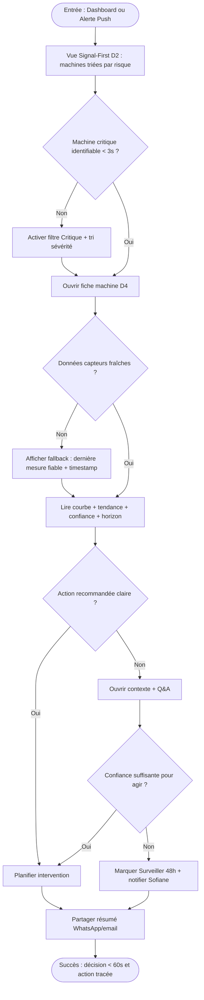
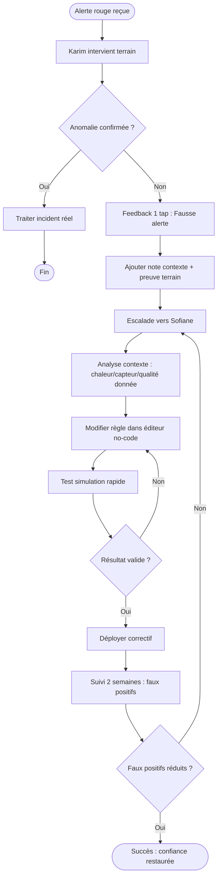
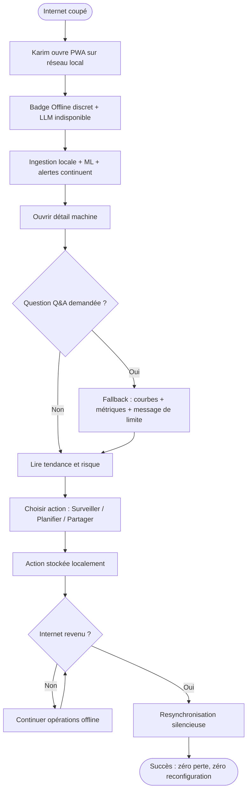
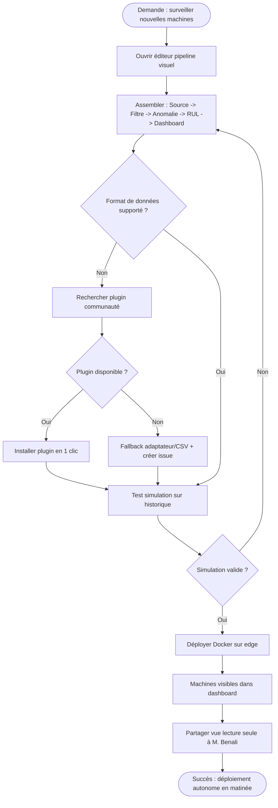

# UX Design Specification ML_Elec

**Author:** Marwane
**Date:** 2026-03-05

---

## Executive Summary

### Project Vision

ML_Elec est la première plateforme de maintenance prédictive pensée pour le
technicien terrain — pas pour le data scientist. Le moment "waouh" de l'utilisateur :
brancher ML_Elec sur un moteur et voir, pour la première fois, l'évolution de la
santé de sa machine dans le temps — une mémoire vivante et lisible, sans expertise
requise.

La contrainte UX non-négociable : **onboarding ≤ 15 minutes**, de l'installation
à la première alerte active. Tout ce qui ralentit ce parcours est un bug de design.

L'application doit fonctionner dans deux modes sans dégradation :
- **Connecté** : LLM actif, explications en langage naturel, Q&A conversationnel
- **Offline** : ML, alertes, dashboards et courbes intacts — le LLM seul est désactivé,
  jamais les fonctions critiques

### Target Users

**Karim — Technicien de Maintenance (utilisateur quotidien)**
Tablette en main, environnement bruyant et chaud, mains souvent occupées.
Usage mixte : ronde proactive le matin (vérification de l'état des machines)
et réponse réactive aux alertes push. Besoin fondamental : voir en 1 coup d'œil
si "ça va" ou "ça va pas" — sans jargon, sans friction, sans formation.
Son moment de bascule : la première intervention préventive réussie grâce à ML_Elec.

**Sofiane — Ingénieur Électricien (configurateur & champion interne)**
Profil technique, maîtrise des normes IEC, évalue et déploie ML_Elec, forme Karim.
Usage intensif en phase de déploiement, modéré en phase d'exploitation.
Besoin fondamental : contrôle total de la configuration (pipelines, modèles, règles,
seuils) sans dépendance à un prestataire extérieur.
Son moment de bascule : présenter le rapport ROI à M. Benali — 2 pannes évitées,
budget débloqué.

**M. Benali — Responsable de Production (décideur budget)**
Ne touche pas à l'interface directement — voit les synthèses que Sofiane lui présente
(en réunion, sur écran partagé). Besoin unique : un seul chiffre lisible en 10 secondes.
"Combien d'euros on a économisé ce mois ?" L'interface doit être conçue pour être
*montrée*, pas utilisée.

**Yasmine — Étudiante Génie Électrique (contributrice open-source)**
Usage sur banc de test, environnement local Docker. Besoin : developer experience
fluide, architecture plugin documentée, contribution frictionless.

### Key Design Challenges

**Challenge 1 — Le gouffre Karim / Sofiane**
Deux profils radicalement opposés partagent la même application. Karim a besoin de
simplicité absolue (1 coup d'œil = décision). Sofiane a besoin de profondeur et de
contrôle (configuration complète, logs, modèles). L'architecture de navigation doit
créer deux espaces distincts sans les isoler — chaque profil doit se sentir "chez lui"
dès la connexion via son rôle RBAC.

**Challenge 2 — La confiance dans les alertes**
Une fausse alerte (Journey 2) détruit la confiance en une intervention. L'interface
doit communiquer le niveau de confiance du modèle ML, permettre le feedback
(utile/fausse alerte) en 1 tap, et montrer le contexte de l'alerte. Sans ce
mécanisme, Karim arrête d'ouvrir l'application silencieusement.

**Challenge 3 — L'offline invisible**
ML_Elec fonctionne offline — mais une bonne UX offline est *transparente*.
L'utilisateur ne doit pas "sentir" qu'il est offline, sauf pour les fonctionnalités
explicitement désactivées (LLM). L'interface doit indiquer l'état de connexion
discrètement, sans créer d'anxiété, et gérer la resynchronisation silencieusement.

### Design Opportunities

**Opportunité 1 — La "mémoire machine" comme paradigme central**
La courbe de santé temporelle est une rupture de paradigme par rapport aux dashboards
à seuils statiques. Au lieu de "le moteur est en rouge", l'utilisateur voit "le moteur
dégrade progressivement depuis 48h". C'est une narration dans le temps — une machine
qui a une histoire. C'est l'élément le plus différenciant visuellement de ML_Elec.

**Opportunité 2 — La vue ROI comme outil de vente interne**
La vue synthétique de M. Benali est une interface conçue pour être *montrée en réunion*
— lisible en 10 secondes, chiffres en gros, pannes évitées traduite en euros.
Bien conçue, cette vue est le meilleur commercial de ML_Elec : Sofiane la projette,
M. Benali signe.

**Opportunité 3 — Le Q&A comme passerelle de confiance**
Le Q&A conversationnel (Journey 7) n'est pas qu'une feature — c'est le mécanisme
qui transforme une courbe incompréhensible en décision d'action concrète.
Karim ne comprend pas les données brutes, mais il comprend "le moteur M-03 dégrade
depuis 3 jours, intervention recommandée dans 10-15 jours".
Bien intégré (accessible depuis la fiche machine, pas dans une page séparée),
ce Q&A devient le "expert dans la poche" de Karim.

---

## Core User Experience

### Defining Experience

L'interaction centrale de ML_Elec est la ronde numérique quotidienne de Karim :
ouvrir l'application, voir en 3 secondes l'état de santé de ses machines, et savoir
quoi faire — sans expertise ML, sans jargon, sans friction.

La boucle de valeur fondamentale : **Signal → Compréhension → Action**.
Toute décision de design est évaluée à l'aune de cette boucle. Si l'une des trois
étapes crée de la friction, la promesse produit s'effondre.

**Fermeture de boucle explicite :** La "Compréhension" seule ne suffit pas. Chaque
alerte doit déboucher sur une action concrète suggérée (FR45). En V1, cette suggestion
est textuelle et copyable — "Planifier une intervention / Commander la pièce / Surveiller
48h" — partageables directement via WhatsApp ou email, sans bouton vers un workflow
GMAO inexistant. La fermeture de boucle est humaine et simple avant d'être automatisée.

Les autres usages (configuration Sofiane, vue ROI M. Benali, Q&A, pipelines)
gravitent autour de ce moment fondateur — ils le rendent possible et le prolongent,
mais ne le remplacent pas.

### Platform Strategy

- **Type** : PWA responsive (web) — Karim sur tablette terrain, Sofiane sur desktop,
  M. Benali en présentation sur n'importe quel écran
- **Offline** : 100% des fonctions core via Service Worker. Contrainte technique
  explicite : cibler les navigateurs modernes (Chrome 80+, Safari 14+) avec
  Service Worker supporté. En environnements IT industriels restrictifs (webviews
  propriétaires), une fallback d'app web classique sans SW est prévue — avec indication
  claire que l'offline n'est pas disponible dans ce mode.
- **Input principal** : Touch-first (Karim, terrain) + Clavier/souris (Sofiane,
  bureau) — deux modes de navigation selon le rôle RBAC
- **Résolution cible** : ≥ 768px (tablette minimum) — usage terrain NFR23
- **Internationalisation** : FR + EN en V1, architecture i18n permettant l'ajout
  d'une nouvelle langue sans recompilation (NFR24)

### Effortless Interactions

**Interactions zéro-friction pour Karim (terrain) :**
- Score de santé lisible sur la liste des machines sans cliquer — glanceability totale
- Compréhension d'une alerte en langage naturel immédiat — zéro jargon technique
- Suggestion d'action concrète textuelle + copyable en 1 tap — pas de formulaire,
  pas de workflow complexe
- Feedback sur une alerte en 1 tap — "utile / fausse alerte"
- Q&A conversationnel accessible depuis la fiche machine — comme interroger un collègue

**Interactions zéro-friction pour Sofiane (configurateur) :**
- Connexion d'une nouvelle source de données par drag & drop — sans code
- Déploiement sur un nouveau site en une commande — `docker compose up`
- Diagnostic d'une fausse alerte avec logs + courbe + feedback Karim réunis au même
  endroit

**Automatismes invisibles (zéro intervention utilisateur) :**
- Détection d'anomalie → alerte → explication LLM → notification push
- Reprise après coupure réseau sans perte de données ni reconfiguration
- Calcul ROI automatique à chaque panne évitée, visible dans la vue direction

### Critical Success Moments

| Moment | Persona | Enjeu |
|---|---|---|
| Onboarding ≤ 15 min complété | Sofiane | Release blocker — abandon avant la première valeur |
| Première courbe de santé affichée | Karim | Moment waouh — rupture avec les outils existants |
| Première alerte préventive reçue | Karim | Conversion — de sceptique à utilisateur convaincu |
| Fausse alerte avec feedback et correction | Karim + Sofiane | Confiance maintenue — l'erreur est récupérable |
| Présentation ROI en réunion direction | Sofiane → M. Benali | Budget débloqué — adoption à l'échelle du site |
| Coupure réseau 100% transparente | Karim | Différenciateur prouvé — ML_Elec est le seul outil qui tient |

### Experience Principles

**Principe 1 — La décision avant le chiffre**
Chaque écran doit répondre à "qu'est-ce que je fais maintenant ?" avant de montrer
des données. Les courbes, scores et métriques existent pour soutenir une décision,
jamais pour être montrées pour elles-mêmes.

**Principe 2 — La confiance se mérite à chaque alerte**
Une fausse alerte non gérée détruit la confiance en silence. Chaque alerte doit
afficher son niveau de confiance, son contexte, et permettre le feedback en 1 tap.
La transparence du modèle ML est une fonctionnalité UX, pas une option.

**Principe 3 — L'offline est la norme, pas l'exception**
L'interface ne doit jamais "surprendre" l'utilisateur lors d'une coupure réseau.
L'état de connexion est indiqué discrètement. Les fonctions dégradées (LLM) sont
clairement signalées sans créer d'anxiété. La resynchronisation est silencieuse.

**Principe 4 — Deux espaces, des ponts entre eux**
Karim et Sofiane ont des besoins radicalement opposés — deux espaces par défaut
via le RBAC. Mais la collaboration terrain existe : Sofiane montre quelque chose à
Karim, Karim envoie une courbe à Sofiane. Des ponts explicites sont prévus —
partage de vue par lien (FR26), vues partagées en lecture seule — sans briser la
séparation des espaces de travail principaux.

**Principe 5 — L'habitude se cultive, pas seulement l'interface**
Une bonne interface de départ ne suffit pas. Si Karim n'ouvre pas l'app 3 jours
de suite, le système engage un mécanisme de réengagement discret : résumé push
hebdomadaire "voici l'état de vos machines cette semaine", pas de spam, pas de
culpabilisation. L'objectif ≥ 3 sessions/semaine est une cible de design, pas
seulement un KPI produit.

---

## Desired Emotional Response

### Primary Emotional Goals

ML_Elec doit provoquer trois émotions fondamentales, dans cet ordre :

**1. Soulagement** — Karim arrive le matin et *sait*. Il n'a plus à se demander si
quelque chose va lâcher. ML_Elec porte l'inquiétude à sa place. Le soulagement est
l'émotion d'entrée — celle qui transforme l'ouverture de l'application en rituel
positif plutôt qu'en source d'anxiété.

**2. Contrôle** — Karim *voit*, Sofiane *configure*. Chaque action est comprise avant
d'être effectuée. L'utilisateur ne subit jamais l'outil — il le dirige. Le contrôle
est l'émotion du quotidien — celle qui fidélise.

**3. Clarté instantanée** — Le résultat est lisible en 3 secondes sans formation,
sans jargon, sans interprétation. "J'ai ouvert, j'ai vu, j'ai compris." C'est
l'émotion qui fait parler : on recommande ce qu'on n'a pas eu besoin de déchiffrer.

---

### Emotional Journey Mapping

| Moment | Émotion cible | Émotion à éviter |
|---|---|---|
| Première ouverture (onboarding) | Curiosité → Confiance rapide | Intimidation, surcharge |
| Ronde quotidienne de Karim | Soulagement → Sécurité | Anxiété, incertitude |
| Détection d'une vraie anomalie | Maîtrise + Fierté professionnelle | Panique, paralysie |
| Fausse alerte potentielle | Alerte préventive → Confiance maintenue | Honte, colère rétroactive |
| Configuration Sofiane | Satisfaction + Sentiment d'expertise | Frustration, dépendance |
| Retour après une absence | Réassurance immédiate | Sentiment d'être "perdu" |
| Présentation ROI à M. Benali | Fierté du champion interne | Incertitude sur les chiffres |

---

### Micro-Emotions

**Confiance** (pas scepticisme) — Chaque alerte doit afficher son niveau de certitude.
Un score de confiance ML visible transforme "le système dit que..." en "j'ai les moyens
de juger si c'est crédible". La confiance se construit par la transparence, pas par
l'autorité.

**Maîtrise** (pas confusion) — "Des clics que je comprenais." Chaque action doit être
anticipable. L'utilisateur doit pouvoir deviner ce qui va se passer avant de cliquer.
Aucun comportement surprenant, aucun effet de bord invisible.

**Fierté professionnelle** (pas dépendance) — Karim ne doit pas se sentir assisté par
une machine qu'il ne comprend pas. Il doit se sentir *augmenté* — un technicien qui a
maintenant des yeux qu'il n'avait pas avant.

**Sécurité préventive** (pas anxiété réactive) — Sur les fausses alertes, l'émotion
clé n'est pas la récupération après l'erreur — c'est la **prévention avant qu'elle
arrive**. ML_Elec doit signaler proactivement quand le contexte d'une alerte est
ambigu (chaleur ambiante élevée, données manquantes, modèle en phase d'apprentissage)
avant que Karim n'intervienne inutilement.

**Flow state** (pas friction) — L'émotion différenciatrice ultime : l'outil disparaît.
"J'ai ouvert, j'ai vu, j'ai compris, j'ai configuré, j'ai tout réglé." Ce sentiment
d'évidence fluide est ce qu'aucun concurrent industriel ne propose aujourd'hui.

---

### Design Implications

**Soulagement → Glanceability absolue**
Le score de santé doit être lisible en moins de 3 secondes sans cliquer, sans scroller.
Vert / orange / rouge avec un texte d'état en langage humain. Pas de chiffres bruts
en première ligne.

**Contrôle → Feedback visible à chaque action**
Chaque modification de configuration (seuil, règle, pipeline) doit afficher un
résumé visible de ce qui a changé et ce que ça implique. L'utilisateur ne doit
jamais se demander "est-ce que mon action a eu un effet ?"

**Clarté instantanée → LLM comme traducteur, pas comme oracle**
Les explications LLM doivent utiliser le vocabulaire *du technicien*, pas du data
scientist. "Vibration anormale sur roulement gauche" plutôt que "anomalie détectée
sur canal vibratoire axial Z, score d'isolation 0.87."

**Prévention des fausses alertes → Indicateur de contexte proactif**
Avant d'afficher une alerte, ML_Elec doit évaluer et afficher les facteurs
contextuels qui pourraient la rendre ambiguë : température ambiante élevée, capteur
récemment ajouté, modèle en phase d'apprentissage (< 7 jours de données).
L'avertissement arrive *avant* l'intervention, pas après.

**Flow state → Progressive disclosure par rôle**
Karim ne voit que ce dont il a besoin pour décider. Sofiane accède à la profondeur
quand il la cherche. Jamais l'inverse. La complexité existe — elle est simplement
invisible jusqu'à ce qu'on en ait besoin.

---

### Emotional Design Principles

**Principe E1 — L'émotion d'entrée détermine l'habitude**
Le premier écran après connexion doit provoquer du soulagement, pas de la surcharge.
Si Karim ouvre ML_Elec et doit chercher l'information importante, l'habitude ne
se formera pas. La hiérarchie visuelle est une décision émotionnelle.

**Principe E2 — Prévenir vaut mieux que récupérer**
Sur les erreurs (fausses alertes, contexte ambigu, modèle incertain), l'objectif
émotionnel n'est pas de bien gérer l'après — c'est d'éviter que l'utilisateur
ressente la honte ou la colère de s'être trompé. ML_Elec prévient avant, pas
seulement explique après.

**Principe E3 — La maîtrise s'enseigne par l'évidence**
Un utilisateur qui comprend *pourquoi* l'outil fait ce qu'il fait développe un
sentiment de maîtrise. Chaque alerte expliquée, chaque action confirmée, chaque
résultat contextualisé construit cette maîtrise — sans formation.

**Principe E4 — Le flow state est le vrai différenciateur**
"J'ai ouvert, j'ai vu, j'ai compris, j'ai configuré, j'ai tout réglé avec des
clics que je comprenais." Ce parcours fluide est l'objectif émotionnel absolu de
ML_Elec. Toute friction qui brise ce flow est un bug de design — même si
techniquement, la fonctionnalité fonctionne.

**Principe E5 — La fierté professionnelle, pas l'assistance**
ML_Elec doit faire sentir à Karim qu'il est un meilleur technicien — pas qu'une
machine surveille à sa place. La différence : "ML_Elec m'a alerté" vs
"j'ai détecté une anomalie grâce à ML_Elec." Le langage de l'interface porte
cette nuance.

---

## UX Pattern Analysis & Inspiration

### Inspiring Products Analysis

#### SAP Predictive Asset Insights / IBM Maximo Predict — La référence fonctionnelle

Ces outils font ce que ML_Elec veut faire : surveillance IoT en temps réel,
détection d'anomalies par IA, RUL calculé, alertes automatiques, planification
intelligente des interventions. Ils ont *résolu le bon problème*.

**Ce qu'ils font bien (à retenir) :**
- Monitoring 24/7 continu sans intervention humaine — le modèle de fond qui tourne
- Calcul RUL explicite avec horizon de défaillance chiffré
- Intégration planification : alerte + suggestion de créneau d'intervention
- Niveaux de sévérité structurés (info / warning / critique)

**Leur problème fondamental (à ne pas reproduire) :**
Ils s'adressent à des équipes avec data scientists, consultants SAP, formations de
plusieurs jours. Un technicien terrain comme Karim ne peut pas les utiliser seul.
ML_Elec prend leurs capacités et leur retire toute la complexité d'accès.

**Insight clé :** Le marché a prouvé que les fonctionnalités sont désirées.
ML_Elec n'a pas à convaincre sur le "pourquoi" — juste sur le "comment,
enfin accessible."

---

#### Mobility Work — Le pattern communautaire et la donnée partagée

Ce qui différencie Mobility Work : les modèles prédictifs s'améliorent grâce aux
données anonymisées de milliers d'utilisateurs. C'est la validation que la
communauté open-source a une valeur produit réelle, pas seulement symbolique.

**Ce qu'ils font bien (à retenir) :**
- Apprentissage collectif anonymisé → modèle qui s'améliore avec la base installée
- GMAO communautaire : l'entraide comme fonctionnalité
- Données partagées = modèle plus robuste pour tous

**Applicabilité ML_Elec :**
Ce pattern est V2+ (marketplace de modèles, ML fédéré) — mais il valide que
l'écosystème open-source est une source d'avantage compétitif à cultiver dès V1
via la communauté GitHub (contributeurs comme Yasmine).

---

#### n8n — Le paradigme de l'éditeur visuel de pipelines ✨

n8n est l'inspiration UX la plus directement applicable à ML_Elec. C'est un outil
d'automatisation de workflows en drag & drop, open-source, qui rend la puissance
des pipelines de données accessible à des non-développeurs — exactement ce que
ML_Elec veut faire pour les pipelines ML industriels.

**Ce qu'il fait bien (à retenir et adapter) :**
- Chaque nœud a un type visuel clair : source / transformation / sortie —
  identifiable en un coup d'œil, même sans lire le label
- Les connexions entre nœuds sont visuelles et logiques — on *voit* le flux de données
- Feedback immédiat lors de l'exécution — chaque nœud indique succès / erreur /
  données traitées en temps réel
- Mode test avec données réelles avant déploiement en production
- Complexité progressive : un pipeline simple est simple, un pipeline avancé reste
  possible sans changer de paradigme

**Adaptation pour ML_Elec :**
Le vocabulaire des nœuds doit être électrotechnique, pas générique : "Source MQTT",
"Filtre harmonique", "Modèle Isolation Forest", "Seuil d'alerte", "Sortie dashboard".
Le paradigme n8n + le lexique industriel = l'éditeur de pipelines de ML_Elec.

---

#### Unreal Engine Blueprint — Le sentiment de puissance visuelle

L'inspiration vient du système Blueprint d'Unreal : un langage de programmation
visuel par nœuds qui donne le sentiment d'une puissance maîtrisée — on configure
quelque chose de complexe sans écrire une ligne de code, et le résultat visuel est
immédiatement satisfaisant.

**Ce qu'il fait bien (à retenir) :**
- Code-par-couleur des nœuds selon leur fonction — la sémantique visuelle précède
  la lecture du texte
- Fil de connexion animé qui montre le flux d'exécution en temps réel
- Sentiment de "je construis quelque chose" — pas "je configure quelque chose"

**Adaptation pour ML_Elec :**
La complexité d'Unreal est excessive pour Sofiane. Mais le *sentiment* — construire
un pipeline ML comme on assemble des blocs Lego intelligents — est exactement ce
qu'on veut reproduire, simplifié. 3-4 types de nœuds maximum en V1, pas 200.

---

### Transferable UX Patterns

**Navigation Patterns :**
- **Dashboard-first par rôle (Maximo)** → Karim arrive sur la liste de ses machines
  avec les scores de santé, Sofiane arrive sur la vue pipelines + statut système.
  Zéro navigation avant de voir l'essentiel.
- **Profondeur progressive (n8n)** → L'écran principal est simple. La complexité
  est accessible en 1 clic, jamais imposée.

**Interaction Patterns :**
- **Drag & drop avec snap intelligent (n8n)** → Les nœuds s'assemblent avec
  des guides visuels. Les connexions invalides sont impossibles à créer — le système
  guide sans bloquer.
- **Feedback nœud-par-nœud en temps réel (n8n + Blueprint)** → Lors de l'exécution
  d'un pipeline, chaque bloc indique son statut (OK / erreur / en cours) en temps réel.
- **Suggestion de créneau d'intervention (Maximo)** → L'alerte ne dit pas juste
  "quelque chose va mal" — elle propose "intervenir mardi entre 6h et 8h (arrêt
  hebdomadaire prévu)". Décision + contexte + suggestion = boucle fermée.
- **Indicateur de confiance visible sur chaque alerte (SAP PAI)** → Pas de décision
  sans niveau de certitude affiché. "Probabilité de défaillance : 87% — basé sur
  14 jours de données."

**Visual Patterns :**
- **Nodes color-coded par type (Blueprint + n8n)** → Sources en bleu,
  transformations en violet, blocs ML en orange, sorties en vert. La sémantique
  visuelle précède la lecture.
- **Timeline de santé comme élément central (inspiration SAP PAI)** →
  Pas un chiffre instantané — une courbe avec une histoire. L'axe temporel est
  le paradigme visuel de ML_Elec.
- **État du système en barre discrète permanente** → Connexion réseau, statut LLM,
  espace disque — visibles en permanence en bas d'écran, discrets, jamais anxiogènes.

---

### Anti-Patterns to Avoid

**Le syndrome SAP/IBM : la complexité comme preuve de puissance**
Ces outils affichent leur profondeur dès l'écran d'accueil — des dizaines de
modules, menus imbriqués, configurations nécessitant une formation. Pour ML_Elec,
la profondeur existe mais est *cachée jusqu'à ce qu'on en ait besoin*.

**Le dashboard "data dump"**
Afficher tous les chiffres disponibles n'est pas de l'information — c'est du bruit.
Chaque métrique visible doit répondre à une question utilisateur identifiée.
Si personne ne pose cette question, la métrique n'est pas sur l'écran principal.

**La configuration par formulaire**
Connecter une source OPC-UA via un formulaire de 12 champs est le anti-pattern
absolu. ML_Elec connecte les sources par drag & drop, avec validation visuelle
immédiate de la connexion.

**L'onboarding documentaire**
"Lisez notre guide de démarrage de 40 pages avant de commencer." L'onboarding
de ML_Elec est un wizard interactif en 5 étapes, avec des données simulées
pré-chargées si aucun équipement réel n'est connecté — la première courbe
de santé s'affiche même avant la connexion d'un vrai capteur.

**L'alerte sans contexte**
"Anomalie détectée sur M-12" sans explication, sans niveau de confiance, sans
suggestion d'action. Ce pattern crée de la charge cognitive sans valeur.
Chaque alerte ML_Elec = anomalie + cause probable + niveau de confiance +
suggestion d'action + contexte environnemental.

---

### Design Inspiration Strategy

**À adopter directement :**
- Paradigme éditeur n8n pour les pipelines ML — drag & drop, nœuds typés,
  feedback temps réel, mode test avant production
- Timeline de santé temporelle comme écran principal de Karim — pas de dashboard
  à seuils statiques
- Indicateur de confiance visible sur chaque alerte (pattern SAP PAI)
- Navigation dashboard-first par rôle RBAC — chaque persona arrive sur son espace

**À adapter :**
- Vocabulaire Blueprint (nœuds colorés, flux animés) → simplifié à 4-5 types
  de nœuds maximum, lexique électrotechnique, pas de node spaghetti
- Calcul RUL + planification (pattern Maximo) → sans l'intégration GMAO en V1,
  remplacé par suggestion textuelle copyable (WhatsApp/email)
- Apprentissage communautaire (Mobility Work) → V2 via marketplace de modèles,
  cultivé dès V1 via contribution GitHub open-source

**À éviter absolument :**
- Complexité d'entrée SAP/IBM — toute configuration qui nécessite une formation
  est un bug de design
- Dashboard data dump — chaque élément visible répond à une question utilisateur
  ou disparaît
- Onboarding documentaire — le wizard interactif est la seule option acceptable

---

## Design System Foundation

### 1.1 Design System Choice

Système retenu : **Themeable System React** avec **shadcn/ui + Tailwind + Radix**,
plus des briques métier spécialisées :
- **React Flow** pour l'éditeur de pipelines
- **ECharts** (ou Recharts) pour les courbes de santé et la RUL
- **TanStack Table** pour les logs et les vues techniques denses

### Rationale for Selection

- Équilibre optimal vitesse + personnalisation, aligné avec l'objectif MVP
- Excellent fit pour PWA responsive tablette/desktop
- Adaptation naturelle aux 2 profils : Karim (simplicité) et Sofiane (profondeur)
- Base accessible, maintenable et solide pour un produit open-source
- Performance et flexibilité visuelle élevées grâce à l'approche headless/thémable

### Implementation Approach

1. Définir les design tokens (couleurs, typo, spacing, états)
2. Monter les composants core (navigation par rôle, alert cards, formulaires)
3. Monter les composants métier (timeline santé, nodes pipeline)
4. Vérifier accessibilité, responsive ≥ 768px, lisibilité en 3 secondes

### Customization Strategy

**Brand tokens (basés sur le logo) :**
- `brand.primary`: `#F28A00` (orange énergie)
- `brand.ink`: `#2F3B46` (anthracite technique)
- `brand.steel`: `#5F6B77` (gris acier)
- `surface.base`: `#F4F6F8` (fond clair industriel)
- `surface.card`: `#FFFFFF`

**Règles d'application :**
- L'orange est réservé aux signaux de décision et actions importantes
- La sévérité système reste dédiée : vert / ambre / rouge (distincte de la marque)
- 80% composants standards thémés, 20% composants métier custom
- V1 vise la cohérence et la vitesse, V1.x enrichit progressivement sans rupture

---

## 2. Core User Experience

### 2.1 Defining Experience

L'expérience définissante de ML_Elec est la **ronde augmentée** : passer de
"signal machine" à "décision de maintenance" en moins d'une minute, sans jargon
et sans friction.

Promesse interactionnelle : **J'ouvre, je vois, je comprends, j'agis.**

- **J'ouvre** (dashboard ou alerte push)
- **Je vois** (courbe de santé + priorité machine)
- **Je comprends** (prédiction, horizon, confiance, contexte)
- **J'agis** (action recommandée : planifier, surveiller, partager)

Formulation coeur : **Voir en 3 secondes, décider en 60 secondes.**

### 2.2 User Mental Model

Les utilisateurs ne pensent pas en "algorithmes ML", ils pensent en décisions terrain :

- Est-ce que cette machine va bien ou pas ?
- Si risque il y a, quand dois-je intervenir ?
- Quelle action concrète je prends maintenant ?

Modèle actuel (sans ML_Elec) :
- Rondes visuelles/auditives
- Seuils techniques peu contextualisés
- Historique dispersé (Excel/papier)
- Interprétation souvent déléguée à un profil expert
- Coordination via WhatsApp/appels rapides

Attentes implicites :
- Réponse claire, pas une analyse académique
- Priorisation immédiate des machines critiques
- Fiabilité perçue (niveau de confiance visible)
- Continuité d'usage même offline

### 2.3 Success Criteria

L'expérience coeur est réussie quand :

1. **Repérage immédiat :** machine à risque identifiée en <= 3 secondes
2. **Compréhension actionnable :** cause + horizon + confiance compris en <= 30 secondes
3. **Décision rapide :** action choisie/partagée en <= 60 secondes
4. **Confiance préservée :** fausse alerte signalée en 1 tap avec récupération claire
5. **Adoption durable :** usage récurrent (objectif >= 3 sessions/semaine)

Indicateurs produit à suivre :
- Time-to-identify (3s target)
- Time-to-action (60s target)
- Taux d'alertes transformées en action
- Taux de feedback "fausse alerte"
- Fréquence de retour utilisateur

### 2.4 Novel UX Patterns

ML_Elec combine des patterns connus avec une innovation d'assemblage.

**Patterns établis :**
- Dashboard priorisé
- Alertes push
- Codes couleur de sévérité
- Courbes temporelles

**Twist ML_Elec :**
- Dans une seule lecture continue : **courbe + prédiction + score de confiance +
  action recommandée**
- LLM utilisé comme traducteur opérationnel (pas oracle opaque)
- Transition immédiate vers action partageable (WhatsApp/email) sans workflow lourd

Positionnement : **Innovation par combinaison** (familiarité d'usage + fermeture
de boucle décisionnelle).

### 2.5 Experience Mechanics

**1) Initiation**
- Déclencheur A : ouverture dashboard (ronde proactive)
- Déclencheur B : push alerte (réaction événementielle)
- Mise en avant immédiate de la machine prioritaire

**2) Interaction**
- Vue liste machines avec santé glanceable
- Sélection de la machine en dérive
- Fiche machine : courbe, tendance, horizon, confiance, contexte
- Choix d'action : planifier / surveiller / partager

**3) Feedback**
- Confirmation explicite de chaque action utilisateur
- Statut visible : alerte lue, action choisie, feedback envoyé
- Si incertitude : contexte affiché (qualité donnée, phase apprentissage,
  facteurs externes)

**4) Completion**
- "C'est fait" quand l'action est planifiée/partagée et la machine repasse en
  surveillance active
- Prochaine étape explicite : revisite au prochain signal significatif

**5) Garde-fous techniques (au service de l'UX)**
- Fraîcheur de donnée visible (timestamp)
- Niveau de confiance explicite sur chaque alerte
- Dégradation gracieuse offline (la boucle décisionnelle reste opérationnelle)

---

## Visual Design Foundation

### Color System

Le système couleur est construit à partir du logo ML_Elec et mappé en rôles
sémantiques UI.

**Brand Core (depuis logo) :**
- `brand.primary`: `#F28A00` (orange énergie)
- `brand.primary.hover`: `#D97706`
- `brand.ink`: `#2F3B46` (anthracite technique)
- `brand.steel`: `#5F6B77` (gris acier)

**Neutres d'interface :**
- `surface.base`: `#F4F6F8`
- `surface.card`: `#FFFFFF`
- `border.default`: `#D8DEE5`
- `text.primary`: `#1F2933`
- `text.secondary`: `#52606D`

**Couleurs sémantiques système (distinctes de la marque) :**
- `success`: `#2E7D32`
- `warning`: `#B7791F`
- `error`: `#C0392B`
- `info`: `#1F6FEB`

**Règles d'usage :**
- L'orange de marque est réservé aux actions, highlights, progression et CTA
- Les états machine (OK/attention/critique) utilisent uniquement success/warning/error
- Jamais de signification portée par la couleur seule : icône + label + couleur

### Typography System

Le ton visuel recherché est : **professionnel, technique, rassurant, moderne**.

**Pairing typographique :**
- Police UI principale : **IBM Plex Sans**
- Police technique (logs, IDs, valeurs capteurs) : **IBM Plex Mono**

**Échelle typographique :**
- `h1`: 32/40, 600
- `h2`: 24/32, 600
- `h3`: 20/28, 600
- `body-lg`: 18/28, 400
- `body`: 16/24, 400
- `caption`: 14/20, 500
- `micro`: 12/16, 500

**Principes de lisibilité :**
- Numériques critiques en `tabular-nums`
- Longueurs de ligne contrôlées pour lecture rapide terrain
- Priorité à la clarté des décisions plutôt qu'à l'effet visuel

### Spacing & Layout Foundation

La structure vise un équilibre entre densité opérationnelle et respiration visuelle.

**Système d'espacement :**
- Base : **8px**
- Sous-unité : 4px
- Scale : 4 / 8 / 12 / 16 / 24 / 32 / 48 / 64

**Grille responsive :**
- Desktop : 12 colonnes
- Tablette (>= 768px) : 8 colonnes
- Gouttières : 16px tablette, 24px desktop

**Principes de layout :**
1. **Decision-first :** info critique visible sans scroll
2. **Progressive disclosure :** détail avancé seulement après intention utilisateur
3. **Zone d'action stable :** actions primaires toujours au même emplacement
4. **Touch-friendly terrain :** cible min 44x44 px

### Accessibility Considerations

- Contraste WCAG AA minimum : 4.5:1 (texte normal), 3:1 (grand texte/UI)
- Focus visible systématique (anneau 2px contrasté)
- États critiques doublés par icône + texte explicite
- Orange marque non utilisé pour texte fin sur fond clair
- Support `prefers-reduced-motion` pour animations
- Validation lisibilité en conditions industrielles (éblouissement, distance tablette)

---

## Design Direction Decision

### Design Directions Explored

Nous avons exploré 8 directions visuelles complètes (D1 à D8), couvrant :
- des approches denses de type control tower,
- des approches card-first orientées signal,
- des vues narratives centrées timeline,
- des layouts split monitor/action,
- des workspaces modulaires orientés ingénierie,
- des modes runbook d'intervention,
- des vues spatiales par zone,
- des modes focus pour décision critique.

La sélection retenue est un mix ciblé : **D4 + D2 + D8 + D6**.

### Chosen Direction

Direction finale : **Hybrid Operational Decision System**

- **Base structure (D4)** : layout split monitor/action pour le flux quotidien
- **Lecture rapide (D2)** : cards signal-first en entrée de dashboard
- **Urgence critique (D8)** : mode focus "une machine, une décision"
- **Exécution terrain (D6)** : mode runbook guidé après décision

Architecture d'expérience :
1. **Triage** (D2/D4)
2. **Décision** (D4/D8)
3. **Exécution** (D6)
4. **Retour monitoring** (D2/D4)

### Design Rationale

Cette combinaison est la plus alignée avec ML_Elec pour 5 raisons :

1. **Alignement avec l'expérience coeur**
   - Respect direct de la promesse : "voir en 3s, décider en 60s"

2. **Compatibilité multi-persona**
   - Karim : clarté et action immédiate (D2, D8)
   - Sofiane : profondeur opérationnelle et technique (D4, D6)

3. **Progressive disclosure maîtrisée**
   - Le système n'impose pas la complexité d'entrée, mais la rend disponible au bon moment

4. **Fermeture de boucle complète**
   - On ne s'arrête pas à l'alerte : diagnostic -> action -> runbook -> suivi

5. **Résilience contexte terrain**
   - Le mode focus et le runbook sont robustes pour usage tablette, bruit, stress et temps limité

### Implementation Approach

**Phase 1 (MVP UI shell)**
- Implémenter la structure D4 (split monitor/action) comme layout principal
- Intégrer les cards D2 en header opérationnel
- Définir les transitions de base : liste -> détail -> action recommandée

**Phase 2 (Critical Decision Mode)**
- Ajouter le mode D8 pour alertes critiques (route/overlay dédiée)
- Ajouter CTA unique prioritaire + résumé partageable

**Phase 3 (Execution Mode)**
- Ajouter D6 runbook pour interventions terrain (étapes, statut, validation)
- Connecter runbook aux actions décidées depuis D4/D8

**Phase 4 (Polish & Metrics)**
- Instrumenter time-to-identify / time-to-action
- Optimiser lisibilité tablette, états hover/touch, et confirmations d'action
- Ajuster densité visuelle selon retours terrain Karim/Sofiane

---

## User Journey Flows

### Journey 1 — Karim : Première anomalie (chemin heureux)

Objectif : passer d'un signal à une action planifiée en moins d'une minute,
sans jargon.

Points UX clés :
- Entrée duale (push + dashboard) pour usage proactif/réactif
- Lecture décisionnelle continue (courbe -> confiance -> action)
- Fallback explicite si données incomplètes

### Journey 2 — Karim : Fausse alerte (récupération de confiance)

Objectif : transformer une erreur potentiellement destructrice en boucle
d'apprentissage.

Points UX clés :
- Feedback utilisateur ultra-court (1 tap)
- Réparation visible et rapide (pas boîte noire)
- Boucle de confiance fermée par résultat mesurable

### Journey 6 — Karim : Coupure réseau, zéro impact (offline-first)

Objectif : maintenir la même logique métier même sans internet.

Points UX clés :
- Dégradation gracieuse, jamais brutale
- Fonctions critiques préservées
- Sync retour invisible pour l'utilisateur

### Journey 3 — Sofiane : Déploiement nouvelle machine

Objectif : déployer un pipeline complet rapidement, sans code, avec voie de
récupération.

Points UX clés :
- No-code réel + validation avant prod
- Stratégie fallback si protocole exotique
- Sortie business directe (partage décideur)

### Journey Patterns

**Navigation Patterns**
- Entrée duale systématique : push (réactif) + dashboard (proactif)
- Vue split monitor/action (D4) comme ossature
- Focus mode (D8) pour moments critiques

**Decision Patterns**
- Entonnoir décisionnel 3s/60s
- Gate de confiance explicite avant action
- Action primaire unique visible en permanence

**Feedback Patterns**
- Confirmation immédiate de chaque action
- États lisibles : lu/en cours/planifié/synchronisé
- Erreurs récupérables avec guidance claire

**Recovery Patterns**
- Fausse alerte -> feedback -> tuning -> mesure de correction
- Offline -> fallback fonctionnel -> sync transparente
- Format non supporté -> plugin -> fallback adaptateur

### Flow Optimization Principles

- **Minimiser les étapes vers la valeur** : chaque flow réduit au strict utile
- **Décision avant données** : hiérarchie construite pour agir, pas contempler
- **Progressive disclosure** : détail seulement après intention utilisateur
- **One-primary-action** : une action dominante par contexte
- **Réversibilité sécurisée** : toute action critique a un chemin de récupération
- **Continuité d'usage** : même logique mentale online/offline
- **Instrumentation produit** : mesurer time-to-identify, time-to-action, recovery time

---

## Component Strategy

### Design System Components

Base retenue : **shadcn/ui + Tailwind + Radix** (+ React Flow, ECharts/Recharts,
TanStack Table)

**Composants foundation disponibles (réutilisation directe) :**
- Layout : `Card`, `Separator`, `ScrollArea`, `Sheet`, `Dialog`, `Tabs`
- Action : `Button`, `DropdownMenu`, `Tooltip`, `Popover`
- Form : `Input`, `Select`, `Checkbox`, `Switch`, `Textarea`
- Feedback : `Alert`, `Toast`, `Progress`, `Skeleton`, `Badge`
- Data : `Table`, `Pagination`, `Accordion`
- Navigation : `Breadcrumb`, `Command`, `Menubar`

**Gaps métier identifiés (non couverts nativement) :**
- Lecture santé machine orientée décision (courbe + confiance + horizon + action)
- Triage machine par risque en mode 3 secondes
- Gestion explicite de confiance ML et fraîcheur des données
- Flux récupération fausse alerte en 1 tap
- Flux offline/synchronisation transparent
- Runbook d'intervention terrain
- Validation pipeline métier avant déploiement

### Custom Components

#### HealthTimelineCard

**Purpose :** Afficher l'état santé machine avec trajectoire et risque actionnable.
**Usage :** Dashboard, fiche machine, focus mode.
**Anatomy :** Header machine + sévérité, courbe, métriques (confiance/horizon), CTA.
**States :** `loading`, `nominal`, `warning`, `critical`, `stale-data`, `offline`.
**Variants :** `compact` (liste Karim), `expanded` (détail Sofiane).
**Accessibility :** `aria-labelledby` machine, alternative textuelle de la tendance.
**Content Guidelines :** Langage opérationnel, pas de jargon ML.
**Interaction Behavior :** Tap ouvre détail ou `FocusDecisionPanel`.

#### MachinePriorityList

**Purpose :** Trier et prioriser les machines par risque immédiat.
**Usage :** Entrée principale D2/D4.
**Anatomy :** Chips de filtres, lignes machine, badges sévérité, horizon.
**States :** `default`, `filtered`, `empty`, `offline`, `error-fetch`.
**Variants :** `dense`, `touch-friendly`.
**Accessibility :** Navigation clavier par ligne, tri annoncé via SR.
**Content Guidelines :** Nom machine + cause courte + action attendue.
**Interaction Behavior :** Sélection persistante, tri stable, deep-link machine.

#### AlertDecisionCard

**Purpose :** Transformer alerte en décision explicite.
**Usage :** Rail action D4, mode focus D8, notifications in-app.
**Anatomy :** Résumé anomalie, cause probable, `ConfidenceBadge`, action recommandée,
contexte.
**States :** `new`, `acknowledged`, `planned`, `false-alert`, `resolved`.
**Variants :** `info`, `warning`, `critical`.
**Accessibility :** Région annoncée, CTA clavier, lecture structurée.
**Content Guidelines :** "Ce qui se passe / Ce qu'il faut faire maintenant".
**Interaction Behavior :** 1 CTA principal + options secondaires (surveiller/partager).

#### ConfidenceBadge

**Purpose :** Rendre la certitude ML lisible et comparable.
**Usage :** Alertes, liste machines, détails modèles.
**Anatomy :** Niveau textuel + score + indicateur visuel.
**States :** `high`, `medium`, `low`, `unknown`.
**Variants :** `inline`, `compact`, `detailed`.
**Accessibility :** Jamais couleur seule ; texte obligatoire ("Confiance élevée 91%").
**Content Guidelines :** Seuils normalisés et documentés.
**Interaction Behavior :** Tooltip explicatif des facteurs de confiance.

#### RecommendedActionBar

**Purpose :** Maintenir l'action prioritaire visible en permanence.
**Usage :** Bas de fiche machine / focus mode / runbook entrée.
**Anatomy :** Action primaire, actions secondaires, impact attendu, statut.
**States :** `enabled`, `disabled`, `queued-offline`, `completed`.
**Variants :** `single-cta`, `dual-cta`.
**Accessibility :** Ordre focus clair, raccourcis clavier, labels explicites.
**Content Guidelines :** Verbes d'action ("Planifier", "Surveiller", "Partager").
**Interaction Behavior :** Sticky, confirmation immédiate, undo si possible.

#### FocusDecisionPanel (D8)

**Purpose :** Réduire le bruit pour décision critique immédiate.
**Usage :** Alerte P1, intervention urgente.
**Anatomy :** Machine cible, courbe large, explication, CTA principal unique.
**States :** `critical-active`, `decision-pending`, `decision-made`, `timeout-warning`.
**Variants :** `fullscreen-mobile`, `split-desktop`.
**Accessibility :** Landmark dédiée, hiérarchie heading stricte.
**Content Guidelines :** 1 problème, 1 décision, 1 prochaine étape.
**Interaction Behavior :** Entrée directe depuis push ; sortie vers runbook.

#### InterventionRunbook (D6)

**Purpose :** Guider l'exécution terrain pas-à-pas.
**Usage :** Après décision planifiée ou immédiate.
**Anatomy :** Liste d'étapes, état courant, notes/preuves, statut global.
**States :** `not-started`, `in-progress`, `blocked`, `completed`, `escalated`.
**Variants :** `quick` (3-5 étapes), `detailed` (procédure complète).
**Accessibility :** Checklists clavier, lecture étape active SR.
**Content Guidelines :** Étapes courtes, verbes impératifs, prérequis explicites.
**Interaction Behavior :** Progression verrouillée configurable, reprise session.

#### OfflineStatusBar

**Purpose :** Informer discrètement sans générer anxiété.
**Usage :** Footer global de l'app.
**Anatomy :** Réseau, LLM, sync locale, timestamp dernière sync.
**States :** `online`, `degraded`, `offline`, `resyncing`.
**Variants :** `minimal`, `expanded-debug`.
**Accessibility :** `aria-live="polite"` pour changements d'état.
**Content Guidelines :** "LLM indisponible, fonctions core actives".
**Interaction Behavior :** Tap ouvre détail sync/diagnostic.

#### SyncQueueIndicator

**Purpose :** Montrer les actions en file locale et leur statut.
**Usage :** Avec offline bar et feedback post-action.
**Anatomy :** Compteur pending, dernier envoi, erreurs retry.
**States :** `empty`, `pending`, `failed`, `retrying`, `synced`.
**Variants :** `badge`, `panel`.
**Accessibility :** Annonces SR sur succès/échec sync.
**Content Guidelines :** Messages orientés confiance ("Aucune donnée perdue").
**Interaction Behavior :** Retry manuel + auto retry.

#### FalseAlertFeedbackControl

**Purpose :** Capturer feedback "utile / fausse alerte" en 1 tap.
**Usage :** Carte alerte, détail machine, historique alertes.
**Anatomy :** Deux actions, champ note optionnel, confirmation.
**States :** `unrated`, `rated-helpful`, `rated-false`, `submitted`.
**Variants :** `inline`, `compact-icon`.
**Accessibility :** Groupe de boutons radio ARIA, labels explicites.
**Content Guidelines :** Demande courte, non culpabilisante.
**Interaction Behavior :** Envoi immédiat + lien vers boucle correction.

#### PipelineNodePalette

**Purpose :** Permettre construction no-code des pipelines (J3).
**Usage :** Éditeur React Flow.
**Anatomy :** Catégories nœuds, search, drag source, preview config.
**States :** `default`, `dragging`, `drop-valid`, `drop-invalid`, `disabled`.
**Variants :** `basic` (Karim read-only), `expert` (Sofiane build mode).
**Accessibility :** Alternative clavier au drag-and-drop.
**Content Guidelines :** Labels électrotechniques (pas data-science).
**Interaction Behavior :** Snap, contraintes de connexion, hints contextuels.

#### PipelineValidationPanel

**Purpose :** Valider avant déploiement (simulation + checks).
**Usage :** Fin de construction pipeline.
**Anatomy :** Checks (latence, qualité données, cohérence), logs, verdict.
**States :** `idle`, `running`, `pass`, `warn`, `fail`.
**Variants :** `summary`, `detailed-log`.
**Accessibility :** Résultats lisibles texte + icône + statut.
**Content Guidelines :** Explication cause + corrective action.
**Interaction Behavior :** "Fix suggestions" actionnables, blocage déploiement
si fail critique.

#### ShareActionSheet

**Purpose :** Partager rapidement la décision terrain (WhatsApp/email/copie).
**Usage :** Fin de décision J1/J2/J6.
**Anatomy :** Résumé généré, canaux, bouton copy, statut envoi/file offline.
**States :** `ready`, `copied`, `queued-offline`, `sent`, `failed`.
**Variants :** `bottom-sheet-mobile`, `popover-desktop`.
**Accessibility :** Focus trap, boutons nommés, confirmation SR.
**Content Guidelines :** Message court "machine / risque / action / créneau".
**Interaction Behavior :** Préremplissage intelligent, fallback copie locale.

### Component Implementation Strategy

**1) Architecture de bibliothèque**
- `tokens` -> `foundation components` -> `domain components` ->
  `screen compositions`
- Tous les custom components consomment strictement les tokens définis en step 8

**2) Contrats de données**
- Modèles UI standardisés : `MachineHealth`, `AlertDecision`, `InterventionTask`,
  `SyncState`, `PipelineValidation`
- Mapping explicite API -> ViewModel pour éviter fuite de complexité backend en UI

**3) Stratégie de composition**
- Foundation (shadcn) non forkés
- Wrappers métier (`Mle*`) pour isoler logique domaine
- Slots pour variantes Karim/Sofiane sans dupliquer les composants

**4) Accessibilité by default**
- WCAG AA minimum
- Keyboard parity sur tous les parcours critiques
- Couleur jamais seule porteuse de sens
- États critiques annoncés via SR

**5) Qualité & maintenabilité**
- Storybook pour chaque composant custom
- Tests unitaires des états critiques (warning/critical/offline/fail)
- Tests d'intégration sur J1/J2/J6/J3
- Budget perf sur listes/courbes (virtualisation si nécessaire)

### Implementation Roadmap

**Phase 1 — Core Decision Loop (MVP prioritaire)**
- `MachinePriorityList`
- `HealthTimelineCard`
- `AlertDecisionCard`
- `ConfidenceBadge`
- `RecommendedActionBar`
- `ShareActionSheet`
- `OfflineStatusBar` (version minimal)
- Objectif : couvrir J1 + base J6

**Phase 2 — Trust & Recovery**
- `FalseAlertFeedbackControl`
- `SyncQueueIndicator`
- enrichissements `AlertDecisionCard` (boucle récupération)
- Objectif : couvrir J2 de bout en bout

**Phase 3 — Critical Mode & Field Execution**
- `FocusDecisionPanel`
- `InterventionRunbook`
- `OfflineStatusBar` (version complète)
- Objectif : couvrir D8 + D6 en conditions terrain

**Phase 4 — Deployment & Engineer Flow**
- `PipelineNodePalette`
- `PipelineValidationPanel`
- composants support éditeur (status chips, test panel)
- Objectif : couvrir J3 autonomie Sofiane

**Phase 5 — Hardening & Scale**
- Polissage cross-device (desktop/tablette/mobile)
- Optimisation performance courbes et listes
- Audit accessibilité complet
- Stabilisation API contracts + documentation composant

---

## UX Consistency Patterns

### Button Hierarchy

**Primary Action**
- **When to Use :** Action principale de l'écran (décision ou validation finale)
- **Visual Design :** Bouton plein `brand.primary` (`#F28A00`), contraste fort,
  label verbe d'action
- **Behavior :** Une seule action primaire visible par vue (règle stricte)
- **Accessibility :** Focus ring 2px, état `aria-busy` pendant loading
- **Mobile Considerations :** Hauteur min 44px, largeur confortable, zone tactile étendue
- **Variants :** `default`, `hover`, `pressed`, `loading`, `disabled`

**Secondary Action**
- **When to Use :** Alternatives valides sans casser le flow principal
- **Visual Design :** Bouton outline/soft, contraste moyen
- **Behavior :** Ne concurrence jamais visuellement le primary
- **Accessibility :** Même ordre tab que logique de décision
- **Mobile Considerations :** Placé sous l'action primaire sur mobile
- **Variants :** `default`, `hover`, `disabled`

**Tertiary / Ghost Action**
- **When to Use :** Actions utilitaires (voir plus, copier, ouvrir détail)
- **Visual Design :** Lien/bouton léger
- **Behavior :** Toujours contextuel, jamais critique
- **Accessibility :** Intitulé explicite (pas "cliquer ici")
- **Mobile Considerations :** Grouper dans menu d'overflow si surcharge

**Destructive Action**
- **When to Use :** Suppression, reset, annulation irréversible
- **Visual Design :** Rouge sémantique (`error`) uniquement
- **Behavior :** Confirmation obligatoire + option undo si possible
- **Accessibility :** Message d'impact clair avant confirmation

**Règles globales bouton**
- Un écran = une intention principale
- Labels en verbe + objet ("Planifier intervention", pas "Valider")
- Pas d'ambiguïté "Annuler/Retour" (termes distincts)

### Feedback Patterns

**Structure universelle**
- Format standard : **Signal -> Contexte -> Prochaine action**
- Exemple : "Alerte critique détectée. Probabilité 91%. Planifier intervention mardi 06:00."

**Succès**
- **When to Use :** Action complétée (planification, partage, feedback)
- **Visual Design :** Vert sémantique + icône + texte
- **Behavior :** Toast court + persistance dans historique action

**Info**
- **When to Use :** État neutre (sync, mise à jour, disponibilité)
- **Visual Design :** Bleu info, ton calme
- **Behavior :** Non bloquant, dismissible

**Warning**
- **When to Use :** Attention requise, action pas immédiate
- **Visual Design :** Ambre, visibilité moyenne-haute
- **Behavior :** Proposer action de mitigation ("Surveiller 48h")

**Error/Critical**
- **When to Use :** Échec d'action, risque machine élevé, incohérence donnée
- **Visual Design :** Rouge + texte explicite + cause
- **Behavior :** Toujours proposer un chemin de récupération

**Offline & Sync feedback**
- Offline : message rassurant ("Fonctions core actives, LLM indisponible")
- Sync pending : compteur discret
- Sync failed : alerte non bloquante + bouton retry
- Sync success : confirmation silencieuse + horodatage

**Fausse alerte**
- Feedback 1 tap obligatoire ("Utile" / "Fausse alerte")
- Confirmation immédiate
- Lien vers boucle d'amélioration visible

### Form Patterns

**Philosophie**
- Formulaires orientés tâche, pas orientés champs
- Progressive disclosure : on montre seulement ce qui est nécessaire maintenant

**Validation**
- Validation inline + validation à soumission
- Erreurs locales par champ + résumé d'erreurs en haut
- Message : cause + correction ("Port invalide, attendu 1-65535")
- Jamais effacer les saisies utilisateur après erreur

**Default values**
- Préremplissage intelligent (source, seuils recommandés, créneau proposé)
- Valeurs par défaut sûres, documentées

**Formulaires pipeline/config**
- Étapes guidées (source -> transformation -> détection -> sortie)
- Check de cohérence avant save
- Simulation/test avant déploiement obligatoire si impact prod

**Actions de formulaire**
- Primary : `Enregistrer` / `Déployer`
- Secondary : `Enregistrer brouillon`
- Tertiary : `Annuler`

**Accessibility**
- Label explicite pour chaque champ
- Description d'aide liée (`aria-describedby`)
- Erreurs vocalisables SR
- Navigation clavier complète

**Mobile considerations**
- Clavier contextuel (numérique pour seuils)
- Groupement des champs en sections courtes
- CTA sticky en bas d'écran pour longues forms

### Navigation Patterns

**Navigation globale**
- Entrée par rôle (Karim/Sofiane) via dashboard-first
- Structure principale ancrée sur D4 (monitor + action)
- Accès focus D8 par deep link depuis alerte push

**Règles de déplacement**
- Toujours un chemin de retour explicite
- Éviter les cul-de-sac (chaque vue critique a une sortie claire)
- Conserver le contexte (machine sélectionnée, filtre actif, plage temps)

**Hiérarchie**
- Niveau 1 : `Overview / Alerts / Machines / Pipelines / ROI / Settings`
- Niveau 2 : détail machine ou runbook
- Niveau 3 : actions avancées (config, diagnostics)

**Push-to-screen pattern**
- Notification push ouvre directement la machine concernée
- Si indisponible : fallback vers liste filtrée sur machine/id alerte

**Mobile vs desktop**
- Desktop/tablette : split view (liste + détail)
- Mobile : stack view (liste puis détail plein écran)
- Le modèle mental reste identique, seul le layout change

**Navigation states**
- Active, hover, disabled, pending sync
- États réseau visibles via `OfflineStatusBar` persistante

### Additional Patterns

**Modal & Overlay Patterns**
- Modal uniquement pour décisions critiques/conflict
- Sheet/bottom-sheet pour actions rapides mobile
- Focus trap obligatoire
- Boutons : primaire à droite (desktop) / en bas (mobile)

**Empty States**
- Toujours expliquer pourquoi l'état est vide
- Toujours proposer une prochaine action ("Ajouter une source", "Réinitialiser filtre")
- Ton rassurant, jamais blâmant

**Loading States**
- Skeleton pour contenu structurel
- Spinner seulement pour bloc court
- Afficher délai estimé si > 2s
- En cas d'échec : transformer loading en recovery state

**Search & Filtering**
- Recherche instantanée avec debounce
- Filtres persistants tant que contexte actif
- Bouton `Réinitialiser filtres` toujours visible
- Résultats : nombre + tri actif + filtre actif

**Table & Chart Interaction**
- Table : tri stable, colonnes essentielles visibles d'abord
- Chart : tooltip actionnable (pas seulement valeur brute)
- Toujours relier visualisation à action ("Voir détail", "Planifier")

**Pattern Rules Design System Integration**
- Utiliser composants shadcn/Radix en priorité
- Toute extension passe par tokens définis step 8
- Aucune couleur ad hoc hors palette sémantique
- Une nouvelle variante composant doit documenter : usage, état, a11y, mobile

**Consistency Governance**
- Checklist UX avant merge : bouton, feedback, form, nav, a11y, mobile
- Storybook obligatoire pour composants custom
- Tests d'intégration sur flows J1/J2/J6/J3 pour valider cohérence inter-écrans

---

## Responsive Design & Accessibility

### Responsive Strategy

ML_Elec adopte une strategie tablet-first operationnelle : la tablette est le poste principal de Karim sur le terrain, le desktop celui de Sofiane pour la configuration avancee.

- Desktop (>= 1024px) : exploitation complete du layout D4 (split monitor/action), densite d'information plus elevee, panneaux simultanes (liste machines + detail + actions), raccourcis clavier pour flux ingenieur.
- Tablet (768px-1023px) : experience prioritaire V1, touch-first, hierarchie visuelle simplifiee, actions critiques toujours visibles (barre d'action sticky), transitions rapides entre triage (D2) et decision (D8).
- Mobile (< 768px) : mode compagnon oriente consultation et reaction rapide (voir alerte, comprendre, accuser, partager). Les taches de configuration lourde sont volontairement limitees et redirigees vers tablette/desktop.

Principe directeur : meme logique mentale sur tous les ecrans, seule la composition visuelle change.

### Breakpoint Strategy

Pour ML_Elec, la strategie est customisee metier (pas uniquement standard), avec un compromis : UX tablet-first + implementation CSS mobile-safe.

Breakpoints recommandes :
- xs : 320-479 (consultation minimale)
- sm : 480-767 (mobile compagnon)
- md : 768-1023 (tablette cible principale V1)
- lg : 1024-1439 (desktop standard)
- xl : 1440+ (desktop large / salle de supervision)

Regles d'adaptation :
- Passage split view -> stack view en dessous de `md`
- Conservation d'une action primaire unique visible dans tous les breakpoints
- Reduction progressive de densite (jamais de perte de clarte decisionnelle)

### Accessibility Strategy

Niveau cible : WCAG 2.1 AA minimum sur tout le produit, avec pratiques AAA sur les parcours critiques quand possible.

Exigences cles :
- Contraste minimum 4.5:1 (texte) et 3:1 (UI large)
- Cibles tactiles >= 44x44px
- Navigation clavier complete sur les parcours critiques (J1, J2, J6, J3)
- Compatibilite lecteur d'ecran (structure semantique, annonces d'etat)
- Focus visible systematique, skip links sur les vues denses
- Information critique jamais portee par la couleur seule (couleur + icone + texte)
- Support `prefers-reduced-motion`
- Langage clair et operationnel (technicien), FR/EN coherents

### Testing Strategy

Strategie de test combinee : reel terrain + automatise + assistive tech.

Responsive testing :
- Tests sur vrais appareils (tablettes Android/iPad + mobile Android/iOS + desktop)
- Matrice navigateurs : Chrome, Edge, Firefox, Safari
- Validation offline reelle (coupure reseau + resynchronisation)

Accessibility testing :
- Automatise : axe-core/Lighthouse dans CI
- Manuel : navigation clavier-only, focus order, pieges de focus
- Screen readers : NVDA (Windows), VoiceOver (macOS/iOS)
- Simulation daltonisme et validation de lisibilite en forte luminosite

User testing :
- Sessions avec profils terrain (Karim/Sofiane)
- Inclusion d'utilisateurs avec besoins d'accessibilite
- Mesure conjointe : comprehension en 3s + action en 60s + taux d'erreur

### Implementation Guidelines

Responsive development :
- Unites relatives (`rem`, `%`, `vw/vh`) en priorite
- Media queries pilotees par tokens de breakpoints
- Grille adaptative 12 -> 8 -> 4 colonnes selon contexte
- Assets optimises par densite ecran et bande passante
- Priorite au contenu critique above-the-fold pour `md` (tablette)

Accessibility development :
- HTML semantique d'abord, ARIA seulement si necessaire
- Contrats composants avec etats accessibles (hover/focus/active/disabled/offline)
- Gestion stricte du focus (modals, sheets, mode focus D8)
- `aria-live` pour alertes/sync, libelles explicites orientes action
- Checklist DoD accessibilite obligatoire avant merge :
  - contraste valide
  - clavier complet
  - reader smoke test
  - touch targets conformes
  - tests offline + etat degrade lisible
